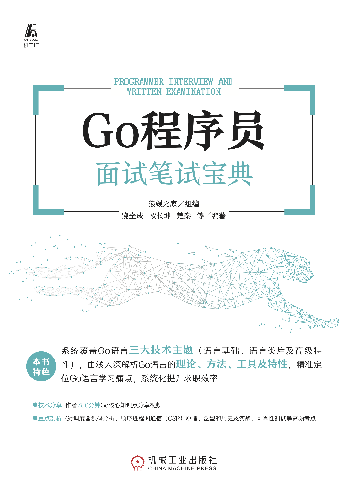

# Go 程序员面试笔试宝典 

_作者_: [饶全成](https://qcrao.com), [欧长坤](https://changkun.de), 楚秦 等编著 
_ISBN_: 978-7-111-70242-9 
_出版社_：[机械工业出版社](http://cmpbook.com) 

## 购买链接

- [京东](https://item.jd.com/13128125.html)
- [当当](http://product.dangdang.com/29390290.html)
- [天猫](https://s.click.taobao.com/Nb3Q9Zu)

## 关于本站

这个站点包含了纸质版图书中的部分内容、对纸质版图书内容的部分更新以及勘误，
我们推荐读者购买实体书籍配合本站共同使用。

## 致读者

因为 Go 语言在服务端的开发效率、服务性能有着不俗的表现，最近几年，Go 的热度越来越高。国内外很多大公司都在大规模地使用 Go。Google 就不用说了，它是 Go 语言诞生的地方，其他公司 如 Meta(Facebook)、uber、腾讯、字节跳动、知乎、脉脉等都在拥抱和转向 Go。用 Go 语言开发的著名开源项目也非常多，如 k8s、docker、etcd、consul，每个名字都是如雷贯耳。

随着市场对 Go 语言人才需求的不断增长，很多开发人员都从其他语言，如 PHP、C++、Java 等 转投 Go 语言的怀抱。因为 Go 语言自身的特点和优势，这些转型的开发人员也能写出性能不错的代码。但是，由于没有深入系统地学习 Go 的底层原理，在某些场景下，因为不懂底层原理，无法快速定位问题、无法进行性能优化。

有些人说，语言并不重要，架构、技术选型这些才是根本。笔者觉得这个说法不完全对，架构、技术选型固然重要，但语言其实是开发人员每天都要打交道的东西，会用是远远不够的，只有用好、知其所以然才能更全面地发挥其威力。

近一两年，笔者在中文世界论坛里发表了很多篇与 Go 源码阅读相关的文章，也是在写作本书的过程中做的功课。我通过看源码、做实验、请教大牛，对 Go 的“理解”逐渐加深。再去看很多文章就会感觉非常简单，为什么这些我都能掌握? 因为我研究过，我知道原理是什么，所以也知道你想要说什么。

最后，无论你是面试官，还是求职者，这本书都能让你有所收获。另外，本书内容不仅仅是对面试有帮助，所有写 Go 的程序员都能从本书中有所收获，能让你的 Go 水平真正上升一个台阶。

## 致谢

在写作本书的过程中，我和本书的二作[欧长坤](https://changkun.de)有很多交流讨论，他对 Go 的理解非常深，他同时也是 Go Contributor，我们的交流和讨论让我对很多问题有了更深入的理解，
非常感谢。我从 [Go 夜读社区](https://talkgo.org) 的分享中学到了很多东西。并且我本人也担任讲师，分享了多期 Go 相关的内容，很多观众都表示很有帮助。教是最好的学，我本人的收获是最多的。感谢 Go 夜读社区的发起者[杨文](https://maiyang.me)及 SIG 小组成员[煎鱼](https://github.com/EDDYCJY/blog)和[傲飞](https://aofei.com)。另外，我和 “Go 圈” 的很多博客作者也有很多交流，比如[曹大](http://xargin.com)、[Draven 大神](https://draveness.me)收获良多，在此一并感谢。这两年，我在 “码农桃花源” 发表了很多文章，得到了很多读者的肯定，这也是我能不断写作的动力，感谢你们。

## 交流和勘误

我们在这里维护了一份已出版内容的[勘误表](https://golang.design/go-questions/errata/)，以帮助并消除读者在阅读过程中出现的困惑。
读者还可以本书的 [GitHub 仓库](https://github.com/golang-design/go-questions)
里讨论关于本书内容的问题，或报告并提交本书存在的错误。

我们欢迎你在 GitHub 仓库上发起 [Issues](https://github.com/golang-design/go-questions/issues/new/choose) 或提交 [Pull Request](https://github.com/golang-design/go-questions/compare)。

我们也欢迎你关注 “码农桃花源” 的公众号，和更多的人一起学习：

## 作者的其他技术分享视频

| 主题 | 作者 | 观看链接 |
|:----|:------|:--------|
| [Go defer 和逃逸分析](https://talkgo.org/t/topic/52) | 饶全成 | [YouTuBe](https://www.youtube.com/watch?v=-FtBBx44E3g&list=PLe5svQwVF1L5bNxB0smO8gNfAZQYWdIpI), [Bilibili](https://www.bilibili.com/video/BV1pb411v7m7) |
| [Go map 源码阅读](https://talkgo.org/t/topic/63) | 饶全成 | [YouTuBe](https://www.youtube.com/watch?v=P2v3kvztWU0&list=PLe5svQwVF1L5bNxB0smO8gNfAZQYWdIpI), [Bilibili](https://www.bilibili.com/video/BV1Q4411W7MR) |
| [Go Scheduler 源码阅读](https://talkgo.org/t/topic/97) | 饶全成 | [YouTuBe](https://www.youtube.com/watch?v=B-ozWjqnX24&list=PLe5svQwVF1L5bNxB0smO8gNfAZQYWdIpI), [Bilibili](https://www.bilibili.com/video/BV1SE411L7LU) |
| [Go channel & select 源码阅读](https://talkgo.org/t/topic/75) | 欧长坤 | [YouTuBe](https://www.youtube.com/watch?v=d7fFCGGn0Wc&list=PLe5svQwVF1L5bNxB0smO8gNfAZQYWdIpI), [Bilibili](https://www.bilibili.com/video/BV1g4411R7p5) |
| [CSP 理解顺序进程间通信](https://talkgo.org/t/topic/85) | 欧长坤 | [YouTuBe](https://www.youtube.com/watch?v=Z8ZpWVuEx8c&list=PLe5svQwVF1L5bNxB0smO8gNfAZQYWdIpI), [Bilibili](https://www.bilibili.com/video/BV1wE411q7G9) |
| [真实世界中的 Go 程序并发错误](https://talkgo.org/t/topic/78) | 欧长坤 | [YouTuBe](https://www.youtube.com/watch?v=WZUii-Czaps&list=PLe5svQwVF1L5bNxB0smO8gNfAZQYWdIpI), [Bilibili](https://www.bilibili.com/video/BV1SJ411w7Ue) |
| [Go 1.14 time.Timer 源码分析](https://talkgo.org/t/topic/93) | 欧长坤 | [YouTuBe](https://www.youtube.com/watch?v=XJx0eTP-y9I&list=PLe5svQwVF1L5bNxB0smO8gNfAZQYWdIpI), [Bilibili](https://www.bilibili.com/video/BV1nJ411j7bU) |
| [Go 2 泛型预览](https://talkgo.org/t/topic/99) | 欧长坤 | [YouTuBe](https://youtu.be/E16Y6bI2S08), [Bilibili](https://www.bilibili.com/video/BV1k7411R7ya/) |
| [对 Go 程序进行可靠的性能测试](https://talkgo.org/t/topic/102) | 欧长坤 | [YouTuBe](https://youtu.be/RXM9cDzWZME), [Bilibili](https://www.bilibili.com/video/BV1ae411x7dM) |
| [Go 1.18 的泛型](https://talkgo.org/t/topic/3582) | 欧长坤 | [YouTuBe](https://youtu.be/ICcss3KKq_0), [Bilibili](https://www.bilibili.com/video/BV1244y1A7BM/) |

## 许可

Go 程序员面试笔试宝典 由 <a href="https://qcrao.com">饶全成</a>, <a href="https://changkun.de">欧长坤</a>, 楚秦等
采用<a rel="license" href="http://creativecommons.org/licenses/by-nc-nd/4.0/">署名-非商业性使用-禁止演绎 4.0 国际许可协议许可</a> 
严禁任何商业行为使用或引用该文档的全部或部分内容，特授权 <a href="https://golang.design">golang.design/go-questions</a> 发布

