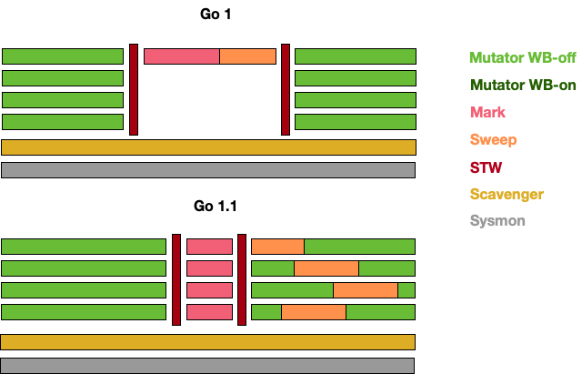
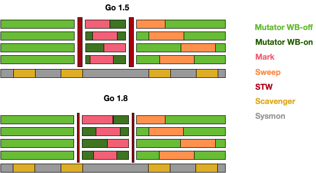
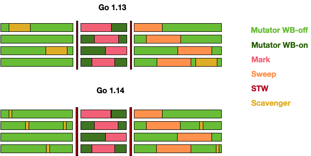

# GC 的历史及演进

## 16. Go 历史各个版本在 GC 方面的改进？

- Go 1：串行三色标记清扫

- Go 1.3：并行清扫，标记过程需要 STW，停顿时间在约几百毫秒

- Go 1.5：并发标记清扫，停顿时间在一百毫秒以内

- Go 1.6：使用 bitmap 来记录回收内存的位置，大幅优化垃圾回收器自身消耗的内存，停顿时间在十毫秒以内

- Go 1.7：停顿时间控制在两毫秒以内

- Go 1.8：混合写屏障，停顿时间在半个毫秒左右

- Go 1.9：彻底移除了栈的重扫描过程 

- Go 1.12：整合了两个阶段的 Mark Termination，但引入了一个严重的 GC Bug 至今未修（见问题 20），尚无该 Bug 对 GC 性能影响的报告

- Go 1.13：着手解决向操作系统归还内存的，提出了新的 Scavenger

- Go 1.14：替代了仅存活了一个版本的 scavenger，全新的页分配器，优化分配内存过程的速率与现有的扩展性问题，并引入了异步抢占，解决了由于密集循环导致的 STW 时间过长的问题

可以用下图直观地说明 GC 的演进历史：



在 Go 1 刚发布时的版本中，甚至没有将 Mark-Sweep 的过程并行化，当需要进行垃圾回收时，所有的代码都必须进入 STW 的状态。而到了 Go 1.3 时，官方迅速地将清扫过程进行了并行化的处理，即仅在标记阶段进入 STW。

这一想法很自然，因为并行化导致算法结果不一致的情况仅仅发生在标记阶段，而当时的垃圾回收器没有针对并行结果的一致性进行任何优化，因此才需要在标记阶段进入 STW。对于 Scavenger 而言，早期的版本中会有一个单独的线程来定期将多余的内存归还给操作系统。



而到了 Go 1.5 后，Go 团队花费了相当大的力气，通过引入写屏障的机制来保证算法的一致性，才得以将整个 GC 控制在很小的 STW 内，而到了 1.8 时，由于新的混合屏障的出现，消除了对栈本身的重新扫描，STW 的时间进一步缩减。

从这个时候开始，Scavenger 已经从独立线程中移除，并合并至系统监控这个独立的线程中，并周期性地向操作系统归还内存，但仍然会有内存溢出这种比较极端的情况出现，因为程序可能在短时间内应对突发性的内存申请需求时，内存还没来得及归还操作系统，导致堆不断向操作系统申请内存，从而出现内存溢出。



到了 Go 1.13，定期归还操作系统的问题得以解决，Go 团队开始将周期性的 Scavenger 转化为可被调度的 goroutine，并将其与用户代码并发执行。而到了 Go 1.14，这一向操作系统归还内存的操作时间进一步得到缩减。

## 17. Go GC 在演化过程中还存在哪些其他设计？为什么没有被采用？

### 并发栈重扫

正如我们前面所说，允许灰色赋值器存在的垃圾回收器需要引入重扫过程来保证算法的正确性，除了引入混合屏障来消除重扫这一过程外，有另一种做法可以提高重扫过程的性能，那就是将重扫的过程并发执行。然而这一方案[11]并没有得以实现，原因很简单：实现过程相比引入混合屏障而言十分复杂，而且引入混合屏障能够消除重扫这一过程，将简化垃圾回收的步骤。

### ROC

ROC 的全称是面向请求的回收器（Request Oriented Collector）[12]，它其实也是分代 GC 的一种重新叙述。它提出了一个请求假设（Request Hypothesis）：与一个完整请求、休眠 goroutine 所关联的对象比其他对象更容易死亡。这个假设听起来非常符合直觉，但在实现上，由于垃圾回收器必须确保是否有 goroutine 私有指针被写入公共对象，因此写屏障必须一直打开，这也就产生了该方法的致命缺点：昂贵的写屏障及其带来的缓存未命中，这也是这一设计最终没有被采用的主要原因。

### 传统分代 GC

在发现 ROC 性能不行之后，作为备选方案，Go 团队还尝试了实现传统的分代式 GC [13]。但最终同样发现分代假设并不适用于 Go 的运行栈机制，年轻代对象在栈上就已经死亡，扫描本就该回收的执行栈并没有为由于分代假设带来明显的性能提升。这也是这一设计最终没有被采用的主要原因。

## 18. 目前提供 GC 的语言以及不提供 GC 的语言有哪些？GC 和 No GC 各自的优缺点是什么？

从原理上而言，所有的语言都能够自行实现 GC。从语言诞生之初就提供 GC 的语言，例如：

- Python
- JavaScript
- Java
- Objective-C
- Swift

而不以 GC 为目标，被直接设计为手动管理内存、但可以自行实现 GC 的语言有：

- C
- C++

也有一些语言可以在编译期，依靠编译器插入清理代码的方式，实现精准的清理，例如：

- Rust

垃圾回收使程序员无需手动处理内存释放，从而能够消除一些需要手动管理内存才会出现的运行时错误：

1. 在仍然有指向内存区块的指针的情况下释放这块内存时，会产生悬挂指针，从而后续可能错误的访问已经用于他用的内存区域。
2. 多重释放同一块申请的内存区域可能导致不可知的内存损坏。

当然，垃圾回收也会伴随一些缺陷，这也就造就了没有 GC 的一些优势：

1. 没有额外的性能开销
2. 精准的手动内存管理，极致的利用机器的性能

## 19. Go 对比 Java、V8 中 JavaScript 的 GC 性能如何？

无论是 Java 还是 JavaScript 中的 GC 均为分代式 GC。分代式 GC 的一个核心假设就是分代假说：将对象依据存活时间分配到不同的区域，每次回收只回收其中的一个区域。

### V8 的 GC

在 V8 中主要将内存分为新生代和老生代。新生代中的对象为存活时间较短的对象，老生代中的对象为存活时间较长、常驻内存、占用内存较大的对象：

1. 新生代中的对象主要通过副垃圾回收器进行回收。该回收过程是一种采用复制的方式实现的垃圾回收算法，它将堆内存一分为二，这两个空间中只有一个处于使用中，另一个则处于闲置状态。处于使用状态的空间称为 From 空间，处于闲置的空间称为 To 空间。分配对象时，先是在 From 空间中进行分配，当开始垃圾回收时，会检查 From 空间中的存活对象，并将这些存活对象复制到 To 空间中，而非存活对象占用的空间被释放。完成复制后，From 空间和 To 空间的角色互换。也就是通过将存活对象在两个空间中进行复制。
2. 老生代则由主垃圾回收器负责。它实现的是标记清扫过程，但略有不同之处在于它还会在清扫完成后对内存碎片进行整理，进而是一种标记整理的回收器。

### Java 的 GC

Java 的 GC 称之为 G1，并将整个堆分为年轻代、老年代和永久代。包括四种不同的收集操作，从上往下的这几个阶段会选择性地执行，触发条件是用户的配置和实际代码行为的预测。

1. 年轻代收集周期：只对年轻代对象进行收集与清理
2. 老年代收集周期：只对老年代对象进行收集与清理
3. 混合式收集周期：同时对年轻代和老年代进行收集与清理
4. 完整 GC 周期：完整的对整个堆进行收集与清理

在回收过程中，G1 会对停顿时间进行预测，竭尽所能地调整 GC 的策略从而达到用户代码通过系统参数（`-XX:MaxGCPauseMillis`）所配置的对停顿时间的要求。

这四个周期的执行成本逐渐上升，优化得当的程序可以完全避免完整 GC 周期。

### 性能比较

在 Go、Java 和 V8 JavaScript 之间比较 GC 的性能本质上是一个不切实际的问题。如前面所说，垃圾回收器的设计权衡了很多方面的因素，同时还受语言自身设计的影响，因为语言的设计也直接影响了程序员编写代码的形式，也就自然影响了产生垃圾的方式。

但总的来说，他们三者对垃圾回收的实现都需要 STW，并均已达到了用户代码几乎无法感知到的状态（据 Go GC 作者 Austin 宣称STW 小于 100 微秒 [14]）。当然，随着 STW 的减少，垃圾回收器会增加 CPU 的使用率，这也是程序员在编写代码时需要手动进行优化的部分，即充分考虑内存分配的必要性，减少过多申请内存带给垃圾回收器的压力。

## 20. 目前 Go 语言的 GC 还存在哪些问题？

尽管 Go 团队宣称 STW 停顿时间得以优化到 100 微秒级别，但这本质上是一种取舍。原本的 STW 某种意义上来说其实转移到了可能导致用户代码停顿的几个位置；除此之外，由于运行时调度器的实现方式，同样对 GC 存在一定程度的影响。

目前 Go 中的 GC 仍然存在以下问题：

### 1. Mark Assist 停顿时间过长

```go
package main

import (
	"fmt"
	"os"
	"runtime"
	"runtime/trace"
	"time"
)

const (
	windowSize = 200000
	msgCount   = 1000000
)

var (
	best    time.Duration = time.Second
	bestAt  time.Time
	worst   time.Duration
	worstAt time.Time

	start = time.Now()
)

func main() {
	f, _ := os.Create("trace.out")
	defer f.Close()
	trace.Start(f)
	defer trace.Stop()

	for i := 0; i < 5; i++ {
		measure()
		worst = 0
		best = time.Second
		runtime.GC()
	}
}

func measure() {
	var c channel
	for i := 0; i < msgCount; i++ {
		c.sendMsg(i)
	}
	fmt.Printf("Best send delay %v at %v, worst send delay: %v at %v. Wall clock: %v \n", best, bestAt.Sub(start), worst, worstAt.Sub(start), time.Since(start))
}

type channel [windowSize][]byte

func (c *channel) sendMsg(id int) {
	start := time.Now()

	// 模拟发送
	(*c)[id%windowSize] = newMsg(id)

	end := time.Now()
	elapsed := end.Sub(start)
	if elapsed > worst {
		worst = elapsed
		worstAt = end
	}
	if elapsed < best {
		best = elapsed
		bestAt = end
	}
}

func newMsg(n int) []byte {
	m := make([]byte, 1024)
	for i := range m {
		m[i] = byte(n)
	}
	return m
}
```

运行此程序我们可以得到类似下面的结果：

```
$ go run main.go

Best send delay 330ns at 773.037956ms, worst send delay: 7.127915ms at 579.835487ms. Wall clock: 831.066632ms 
Best send delay 331ns at 873.672966ms, worst send delay: 6.731947ms at 1.023969626s. Wall clock: 1.515295559s 
Best send delay 330ns at 1.812141567s, worst send delay: 5.34028ms at 2.193858359s. Wall clock: 2.199921749s 
Best send delay 338ns at 2.722161771s, worst send delay: 7.479482ms at 2.665355216s. Wall clock: 2.920174197s 
Best send delay 337ns at 3.173649445s, worst send delay: 6.989577ms at 3.361716121s. Wall clock: 3.615079348s 
```


在这个结果中，第一次的最坏延迟时间高达 7.12 毫秒，发生在程序运行 578 毫秒左右。通过 `go tool trace` 可以发现，这个时间段中，Mark Assist 执行了 7112312ns，约为 7.127915ms；可见，此时最坏情况下，标记辅助拖慢了用户代码的执行，是造成 7 毫秒延迟的原因。

<!-- https://github.com/golang/go/issues/27732 -->
<!-- https://github.com/golang/go/issues/27410 -->

### 2. Sweep 停顿时间过长

同样还是刚才的例子，如果我们仔细观察 Mark Assist 后发生的 Sweep 阶段，竟然对用户代码的影响长达约 30ms，根据调用栈信息可以看到，该 Sweep 过程发生在内存分配阶段：


<!-- https://github.com/golang/go/issues/18155 -->

### 3. 由于 GC 算法的不正确性导致 GC 周期被迫重新执行

此问题很难复现，但是一个已知的问题，根据 Go 团队的描述，能够在 1334 次构建中发生一次 [15]，我们可以计算出其触发概率约为 0.0007496251874。虽然发生概率很低，但一旦发生，GC 需要被重新执行，非常不幸。

<!-- https://github.com/golang/go/issues/27993 -->

### 4. 创建大量 Goroutine 后导致 GC 消耗更多的 CPU

这个问题可以通过以下程序进行验证：

```go
func BenchmarkGCLargeGs(b *testing.B) {
	wg := sync.WaitGroup{}

	for ng := 100; ng <= 1000000; ng *= 10 {
		b.Run(fmt.Sprintf("#g-%d", ng), func(b *testing.B) {
			// 创建大量 goroutine，由于每次创建的 goroutine 会休眠
			// 从而运行时不会复用正在休眠的 goroutine，进而不断创建新的 g
			wg.Add(ng)
			for i := 0; i < ng; i++ {
				go func() {
					time.Sleep(100 * time.Millisecond)
					wg.Done()
				}()
			}
			wg.Wait()

			// 现运行一次 GC 来提供一致的内存环境
			runtime.GC()

			// 记录运行 b.N 次 GC 需要的时间
			b.ResetTimer()
			for i := 0; i < b.N; i++ {
				runtime.GC()
			}
		})

	}
}
```

其结果可以通过如下指令来获得：

```shell
$ go test -bench=BenchmarkGCLargeGs -run=^$ -count=5 -v . | tee 4.txt
$ benchstat 4.txt
name                     time/op
GCLargeGs/#g-100-12       192µs ± 5%
GCLargeGs/#g-1000-12      331µs ± 1%
GCLargeGs/#g-10000-12    1.22ms ± 1%
GCLargeGs/#g-100000-12   10.9ms ± 3%
GCLargeGs/#g-1000000-12  32.5ms ± 4%
```

这种情况通常发生于峰值流量后，大量 goroutine 由于任务等待被休眠，从而运行时不断创建新的 goroutine，
旧的 goroutine 由于休眠未被销毁且得不到复用，导致 GC 需要扫描的执行栈越来越多，进而完成 GC 所需的时间越来越长。
一个解决办法是使用 goroutine 池来限制创建的 goroutine 数量。

<!-- https://github.com/golang/go/issues/34457 -->
